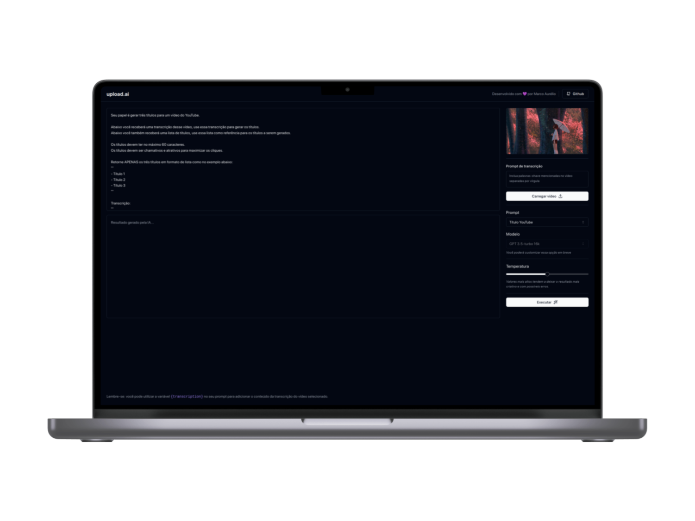

  

 

  
  <a aria-label="Completed" href="https://rocketseat.com.br/">
    </img>
  </a>

## :speech_balloon: Sobre

Este projeto foi desenvolvido na trilha Mastery da NLW IA da [Rocketseat](https://www.rocketseat.com.br). 
O projeto consiste em um gerador de descrições e títulos de vídeos a partir da transcrição de seu conteúdo. 
 
O processo é básicamente o seguinte:
1. O usuário carrega o vído para o qual deseja gerar o título e a descrição;
2. O vídeo é transformado em áudio com o FFmpeg (no browser usando WebAssembly);
3. O áudio é enviado ao back-end que, usando a API da OpenAI, utiliza o modelo Whisper para gerar a transcrição completa do áudio;
4. Com a transcrição do áudio, é realizado uma nova chamada à API da OpenAI para que, com base no prompt fornecido pelo usuário, sejam geradas a descrição e o título;

## :camera: Preview 

  

## :rocket: Tecnologias Utilizadas

  
  
  
  
  
  
  
  
  

 

  Feito com :purple_heart:

